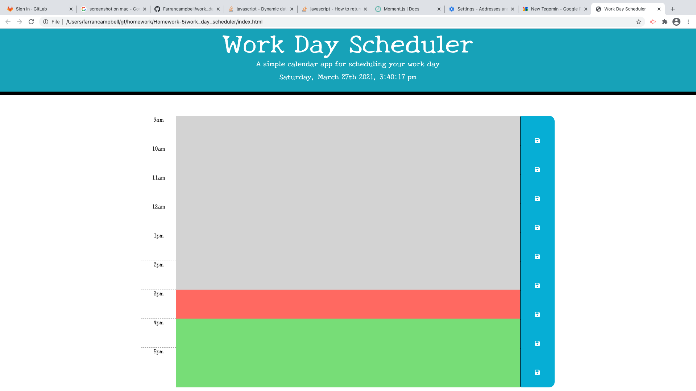

# work_day_scheduler

This is a standard work day scheduler, with dynamic date and time. What we did was take our boot strap elements for a medium colum and add jquery code. We also used local storage techniques to allow the items added in each time slot to be saved. 

[GIT HUB](https://github.com/Farrancampbell/work_day_scheduler)

